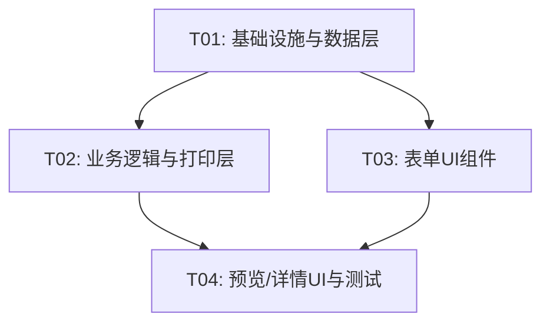

# 处方打印程序 V2 — 增量系统设计

> **项目**: prescription-printer（Electron + Vite + React + MUI v5 + Tailwind + TypeScript + SQLite）
> **版本**: v1.0 → v2.0
> **设计人**: Bob（软件架构师）
> **日期**: 2026-06-22

---

## 目录

1. [变更概览](#1-变更概览)
2. [数据库变更](#2-数据库变更)
3. [新增/修改文件清单](#3-新增修改文件清单)
4. [受影响的 IPC 通道](#4-受影响的-ipc-通道)
5. [前端常量定义](#5-前端常量定义)
6. [数据流与类型变更](#6-数据流与类型变更)
7. [增量任务列表](#7-增量任务列表)
8. [共享知识](#8-共享知识)
9. [任务依赖图](#9-任务依赖图)
10. [待明确事项](#10-待明确事项)

---

## 1. 变更概览

| 变更编号 | 描述 | 影响层级 |
|---------|------|---------|
| C1 | `dosage` 拆分为 `dosage`（用量）+ `usage_method`（用法） | 数据库 + 类型 + 全部UI + 打印 |
| C2 | 科别/用法/所在科室改为下拉选择 | 前端UI + 常量 |
| C3 | `doctor_name` 非必填，签名位预留 | 数据库 + 验证 + 打印 + UI |
| C4 | A5打印布局固定 | 打印 + 预览CSS |

---

## 2. 数据库变更

### 2.1 策略

由于是**全新应用（无旧数据需迁移）**，直接修改 `electron/database.ts` 中的 `CREATE TABLE IF NOT EXISTS` 语句即可。已部署环境如需升级，手动删除旧数据库文件后重启应用自动重建。

### 2.2 prescription_medicines 表变更

**变更前**（v1.0）：
```sql
CREATE TABLE IF NOT EXISTS prescription_medicines (
  id INTEGER PRIMARY KEY AUTOINCREMENT,
  prescription_id INTEGER NOT NULL,
  medicine_name TEXT NOT NULL,
  specification TEXT DEFAULT '',
  dosage TEXT DEFAULT '',          -- ★ 旧字段：用法用量（混合）
  instructions TEXT DEFAULT '',
  sort_order INTEGER NOT NULL DEFAULT 0,
  FOREIGN KEY (prescription_id) REFERENCES prescriptions(id) ON DELETE CASCADE
);
```

**变更后**（v2.0）：
```sql
CREATE TABLE IF NOT EXISTS prescription_medicines (
  id INTEGER PRIMARY KEY AUTOINCREMENT,
  prescription_id INTEGER NOT NULL,
  medicine_name TEXT NOT NULL,
  specification TEXT DEFAULT '',
  dosage TEXT DEFAULT '',          -- ★ 新含义：用量（如"每日3次，每次1片"）
  usage_method TEXT DEFAULT '',    -- ★ 新增：用法（如"口服"）
  instructions TEXT DEFAULT '',
  sort_order INTEGER NOT NULL DEFAULT 0,
  FOREIGN KEY (prescription_id) REFERENCES prescriptions(id) ON DELETE CASCADE
);
```

> **说明**：`dosage` 字段保留但**语义变更**——v1.0 存 "用法用量"（混合），v2.0 仅存"用量"。新增 `usage_method` 存"用法"。因为全新应用，直接改 CREATE TABLE 即可。

### 2.3 prescriptions 表变更

**变更前**（v1.0）：
```sql
doctor_name TEXT NOT NULL DEFAULT '',   -- ★ 必填
```

**变更后**（v2.0）：
```sql
doctor_name TEXT DEFAULT '',            -- ★ 改为可为空
```

> **仅改动一行**：去掉 `NOT NULL` 约束。

### 2.4 等效 DDL（供参考）

```sql
-- 如果要手动迁移已有数据库，执行：
ALTER TABLE prescription_medicines ADD COLUMN usage_method TEXT DEFAULT '';
-- 注意：SQLite 不支持 DROP COLUMN（3.35.0 前），建议重建表或直接依赖新表结构
```

---

## 3. 新增/修改文件清单

| 状态 | 文件路径 | 变更说明 |
|------|---------|---------|
| **ADDED** | `src/constants/dictionaries.ts` | 新增：科别/用法/所在科室三个字典常量 |
| **MODIFIED** | `src/types/index.ts` | Medicine 接口新增 `usage_method`；DEFAULT_FORM_DATA 新增 `usage_method`；`validatePrescriptionForm` 签名调整 |
| **MODIFIED** | `electron/database.ts` | ① `prescription_medicines` 表定义新增 `usage_method` ② `MedicineInput` 接口新增 `usage_method` ③ `stmtInsertMedicine` 和 `savePrescription` 增加 `usage_method` 写入 |
| **MODIFIED** | `electron/main.ts` | `db:save-prescription` IPC handler 的 medicines 类型增加 `usage_method` |
| **MODIFIED** | `electron/preload.ts` | `MedicineInput` 接口增加 `usage_method`；`SavePrescriptionPayload` 类型同步 |
| **MODIFIED** | `electron/print-handler.ts` | ① 打印 HTML 表头"用法用量"拆为"用量"+"用法"两列 ② 医师签名位逻辑（空→下划线）③ CSS 严格 A5 尺寸 |
| **MODIFIED** | `src/context/PrescriptionContext.tsx` | ① `ADD_MEDICINE` action 默认值增加 `usage_method: ''` ② `LOAD_PRESCRIPTION` 回填增加 `usage_method` |
| **MODIFIED** | `src/utils/format.ts` | `validatePrescriptionForm`：① 移除 `doctor_name` 必填校验 ② 新增 `usage_method` 字典范围校验 |
| **MODIFIED** | `src/pages/PrescribePage.tsx` | ① 保存 payload 中 medicines 增加 `usage_method` ② 预览数据构建增加 `usage_method` |
| **MODIFIED** | `src/components/PatientInfo.tsx` | 科别（`department`）由 `TextField` 改为 `Select`，数据源来自 `DEPARTMENT_OPTIONS` |
| **MODIFIED** | `src/components/MedicineList.tsx` | ① 表头"用法用量"拆为"用量"+"用法"两列 ② "用法"列使用 `Select`（`USAGE_METHOD_OPTIONS`）③ 字段绑定 `dosage`→用量、`usage_method`→用法 |
| **MODIFIED** | `src/components/DoctorInfo.tsx` | ① 医师姓名移除 `required` ② 所在科室由 `TextField` 改为 `Select`（`DOCTOR_DEPARTMENT_OPTIONS`） |
| **MODIFIED** | `src/components/PreviewDialog.tsx` | ① 表头拆分"用量"+"用法" ② 渲染 `med.dosage` + `med.usage_method` ③ 医师签名为空显示下划线 ④ A5 比例 CSS 约束 |
| **MODIFIED** | `src/components/PrescriptionDetail.tsx` | ① 表头拆分"用量"+"用法" ② 渲染 `med.dosage` + `med.usage_method` ③ 医师签名为空显示下划线 |
| **MODIFIED** | `src/context/__tests__/PrescriptionContext.test.ts` | 测试数据中的 Medicine 对象增加 `usage_method` 字段 |
| **MODIFIED** | `src/utils/__tests__/format.test.ts` | ① 移除"医师姓名为空应报错"测试 ② 新增"doctor_name 为空应通过"测试 |

> **未修改的文件**：`src/App.tsx`、`src/main.tsx`、`src/index.css`、`src/pages/HistoryPage.tsx`、`src/components/DiagnosisInfo.tsx`、`vite.config.ts`、`tailwind.config.js`、`package.json`、`tsconfig.json` 等配置文件**无需变更**。

---

## 4. 受影响的 IPC 通道

| 通道名 | 影响类型 | 说明 |
|-------|---------|------|
| `db:save-prescription` | **签名变更** | payload 中 `medicines[].dosage` 语义变更 + 新增 `medicines[].usage_method` |
| `db:generate-prescription-no` | 无变化 | — |
| `db:get-next-seq` | 无变化 | — |
| `db:get-prescriptions` | 无变化 | — |
| `db:get-prescription-detail` | **返回数据变化** | 返回的 medicines 数组每项新增 `usage_method` 字段 |
| `print:direct` | 无变化 | 传入数据不变，主进程侧 HTML 渲染逻辑变化 |

> **重要**：`db:save-prescription` 的调用方（`PrescribePage.tsx`）必须同步更新 payload 结构。

---

## 5. 前端常量定义

### 5.1 `src/constants/dictionaries.ts` 数据结构

```typescript
/**
 * 处方系统字典常量。
 * 所有下拉选项以常量数组形式定义，不建数据库字典表。
 */

// ---- 科别字典 ----

export const DEPARTMENT_OPTIONS = [
  { value: '内科', label: '内科' },
  { value: '外科', label: '外科' },
] as const;

export type DepartmentValue = (typeof DEPARTMENT_OPTIONS)[number]['value'];

// ---- 用法字典 ----

export const USAGE_METHOD_OPTIONS = [
  { value: '口服', label: '口服' },
  { value: '输液', label: '输液' },
  { value: '治疗', label: '治疗' },
  { value: '注射', label: '注射' },
  { value: '雾化', label: '雾化' },
  { value: '其他', label: '其他' },
] as const;

export type UsageMethodValue = (typeof USAGE_METHOD_OPTIONS)[number]['value'];

// ---- 医师所在科室字典 ----

export const DOCTOR_DEPARTMENT_OPTIONS = [
  { value: '内科门诊', label: '内科门诊' },
  { value: '外科门诊', label: '外科门诊' },
  { value: '预防接种科', label: '预防接种科' },
  { value: '体检科', label: '体检科' },
] as const;

export type DoctorDepartmentValue = (typeof DOCTOR_DEPARTMENT_OPTIONS)[number]['value'];
```

### 5.2 字典映射关系

| UI 字段 | 数据库字段 | 数据源常量 |
|---------|-----------|-----------|
| 科别（患者） | `prescriptions.department` | `DEPARTMENT_OPTIONS` |
| 用法 | `prescription_medicines.usage_method` | `USAGE_METHOD_OPTIONS` |
| 所在科室（医师） | `prescriptions.doctor_department` | `DOCTOR_DEPARTMENT_OPTIONS` |

---

## 6. 数据流与类型变更

### 6.1 Medicine 接口变更

```typescript
// v1.0
export interface Medicine {
  id?: number;
  prescription_id?: number;
  medicine_name: string;
  specification: string;
  dosage: string;             // 旧：混合用法用量
  instructions: string;
  sort_order: number;
}

// v2.0
export interface Medicine {
  id?: number;
  prescription_id?: number;
  medicine_name: string;
  specification: string;
  dosage: string;             // 新：仅用量（如"每日3次，每次1片"）
  usage_method: string;       // ★ 新增：用法（如"口服"）
  instructions: string;
  sort_order: number;
}
```

### 6.2 完整调用序列（保存 + 打印）

详见 `docs/sequence-diagram.mermaid`。

### 6.3 类图

详见 `docs/class-diagram.mermaid`。

---

## 7. 增量任务列表

### T01 — 基础设施与数据层

| 属性 | 值 |
|------|---|
| **任务ID** | T01 |
| **优先级** | P0 |
| **依赖** | 无 |

**源文件**：

| 文件 | 操作 |
|------|------|
| `src/constants/dictionaries.ts` | **ADDED** — 创建三个字典常量（DEPARTMENT_OPTIONS / USAGE_METHOD_OPTIONS / DOCTOR_DEPARTMENT_OPTIONS） |
| `src/types/index.ts` | MODIFIED — ① Medicine 接口新增 `usage_method: string` ② DEFAULT_FORM_DATA 新增 `usage_method: ''` |
| `electron/database.ts` | MODIFIED — ① CREATE TABLE prescription_medicines 新增 `usage_method` 列 ② MedicineInput 接口新增 `usage_method` ③ stmtInsertMedicine / savePrescription 写入 usage_method ④ prescriptions 表 doctor_name 去掉 NOT NULL |
| `electron/main.ts` | MODIFIED — `db:save-prescription` handler 中 medicines 类型增加 `usage_method` 字段 |
| `electron/preload.ts` | MODIFIED — MedicineInput 接口新增 `usage_method`，SavePrescriptionPayload 同步 |
| `src/context/PrescriptionContext.tsx` | MODIFIED — ① ADD_MEDICINE 默认值增加 `usage_method: ''` ② LOAD_PRESCRIPTION 回填增加 `usage_method` 字段映射 |

**完成标准**：
- TypeScript 编译无错误（`npx tsc --noEmit`）
- `src/constants/dictionaries.ts` 可正常 import
- 数据库新表结构包含 `usage_method` 列，`doctor_name` 可为空

---

### T02 — 业务逻辑与打印层

| 属性 | 值 |
|------|---|
| **任务ID** | T02 |
| **优先级** | P0 |
| **依赖** | T01 |

**源文件**：

| 文件 | 操作 |
|------|------|
| `src/utils/format.ts` | MODIFIED — ① `validatePrescriptionForm` 移除 `doctor_name` 必填校验 ② 函数签名适应 Medicine 类型变化 |
| `src/pages/PrescribePage.tsx` | MODIFIED — ① `handleSave` 中 medicines payload 增加 `usage_method` ② `handlePreview` 中构建预览数据增加 `usage_method` |
| `electron/print-handler.ts` | MODIFIED — ① 表头"用法用量"拆为"用量"+"用法"两列 `<th>` ② medicineRows 渲染 `med.dosage` + `med.usage_method` ③ 医师签名逻辑：`doctor_name` 为空时显示 `____________` ④ CSS `body` 宽度严格 `148mm`，`@page` 补全 A5 尺寸声明 |

**完成标准**：
- `npm run dev` 启动后保存处方不再要求医师姓名
- 打印 HTML 中包含用量+用法两列
- 医师为空时打印显示 6 个下划线

---

### T03 — 表单UI组件

| 属性 | 值 |
|------|---|
| **任务ID** | T03 |
| **优先级** | P0 |
| **依赖** | T01 |

**源文件**：

| 文件 | 操作 |
|------|------|
| `src/components/PatientInfo.tsx` | MODIFIED — 科别字段：`TextField` → `Select`，import `DEPARTMENT_OPTIONS`，遍历生成 `<MenuItem>` |
| `src/components/MedicineList.tsx` | MODIFIED — ① 表头新增"用法"列（用量在前、用法在后）② "用法"列用 `Select` + `USAGE_METHOD_OPTIONS` ③ 字段绑定：第3列→`dosage`（TextField，placeholder:"如：每日3次，每次1片"），第4列→`usage_method`（Select），医嘱→第5列 |
| `src/components/DoctorInfo.tsx` | MODIFIED — ① 医师姓名 `TextField` 移除 `required` 属性 ② 所在科室：`TextField` → `Select`，import `DOCTOR_DEPARTMENT_OPTIONS` |

**完成标准**：
- UI 表单中科别、用法、所在科室均为下拉选择
- 药品表格显示 5 列：药品名称 | 规格 | 用量 | 用法 | 医嘱 | 操作
- 医师姓名不显示红色必填星号

---

### T04 — 预览/详情UI与测试

| 属性 | 值 |
|------|---|
| **任务ID** | T04 |
| **优先级** | P1 |
| **依赖** | T01, T02, T03 |

**源文件**：

| 文件 | 操作 |
|------|------|
| `src/components/PreviewDialog.tsx` | MODIFIED — ① 表头拆分为"用量"+"用法"两列 ② 渲染 `med.dosage` 和 `med.usage_method` ③ 医师签名：`prescription.doctor_name \|\| '____________'` ④ CSS 增加 `width: 148mm; min-height: 210mm` + `@media print` 补全 |
| `src/components/PrescriptionDetail.tsx` | MODIFIED — ① 表头拆分为"用量"+"用法"两列 ② 渲染 `med.dosage` + `med.usage_method` ③ 医师签名空值显示 `____________` |
| `src/context/__tests__/PrescriptionContext.test.ts` | MODIFIED — 测试数据中的 Medicine 对象增加 `usage_method: ''` 字段 |
| `src/utils/__tests__/format.test.ts` | MODIFIED — ① 删除"医师姓名为空应报错"的测试用例 ② 新增"doctor_name 为空时应通过验证"用例 ③ 所有 validFormData 增加 doctor_name: '' |

**完成标准**：
- `npm test`（vitest）全部通过
- 预览对话框显示用量、用法两列
- 医师签名为空时预览显示 `____________`
- 预览对话框宽度按 A5 比例渲染

---

## 8. 共享知识

```
- 所有 IPC 调用通过 window.electronAPI 访问，渲染进程不直接调用 ipcRenderer
- 数据库操作全部在 Electron 主进程执行（better-sqlite3 同步 API）
- 处方编号格式不变：YYYYMMDD + 4位流水号（如 202607220001）
- 所有日期存储格式：YYYY-MM-DD（ISO 8601 date）
- 字典数据源：前端常量 src/constants/dictionaries.ts，不建数据库表
- 打印页面采用隐藏 BrowserWindow + loadURL(data:...) 方式
- 预览 Dialog 的 PaperProps.maxWidth 模拟 A5 比例（约 580px 对应 148mm @ 96dpi）
- 签名位采用 6 个下划线字符 "____________"，不带提示文字
- 测试框架：vitest + jsdom
- React 组件需使用 createElement 模式（当前代码风格）
```

---

## 9. 任务依赖图



> T02 和 T03 均可并行开发（都只依赖 T01），T04 需要等待 T01+T02+T03 全部完成后集成。

---

## 10. 待明确事项

| # | 问题 | 当前假设 |
|---|------|---------|
| 1 | 暂无 | 所有决策已在 PRD 中明确 |

**已明确（来自 PRD 决策）**：
- Q1: 旧数据无需迁移（全新应用）→ 直接改 CREATE TABLE
- Q2: 字典存为前端常量 `src/constants/dictionaries.ts`
- Q3: 用法字典固定 6 项，不扩展
- Q4: 签名位："____________"（6 个下划线字符），不带提示文字
- Q5: CSS 约束预览 + 系统打印 API 设置纸张
- Q6: 数据库字段名保持 `department`（患者科别）和 `doctor_department`（医师科室）

---

*本文档由 Bob（软件架构师）生成，供 Engineer 实施参考。*
